# Ezpara-Introduction  
Hello, this repository describes the technical features of EzPara and contains no code.

EzPara is an engaging and interactive mobile app that combines entertainment with rewards. Designed for users who love gaming and earning, EzPara allows you to play fun games, complete tasks, and claim daily rewards to accumulate EzCoins. These EzCoins can then be redeemed for exciting products available in the in-app marketplace.

Built with cutting-edge technologies, EzPara ensures a seamless, secure, and user-friendly experience. Whether you’re looking to pass time with exciting challenges or earn rewards through consistent engagement, EzPara is your go-to app.

Explore the thrill of gaming, complete daily tasks, and unlock exclusive marketplace items, all within a single platform.

## Table of Contents
- [Mockups](#mockups)
- [Downloads & Video Links](#downloads--video-links)
- [Technologies Used](#technologies-used)
- [Project Structure](#project-structure)
- [Directory Explanation](#directory-explanation)
- [Several Screenshots](#several-screenshots)

## Mockups

<p>
  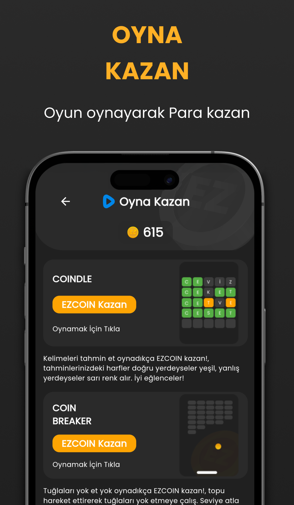
  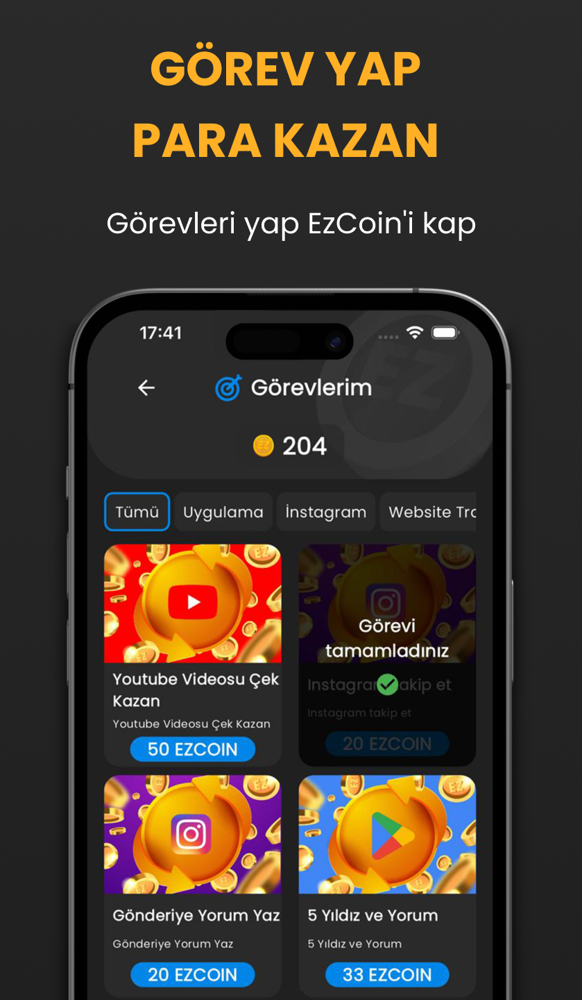
  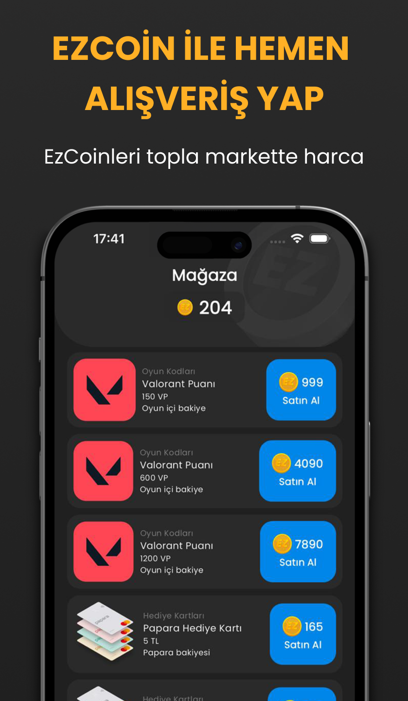
  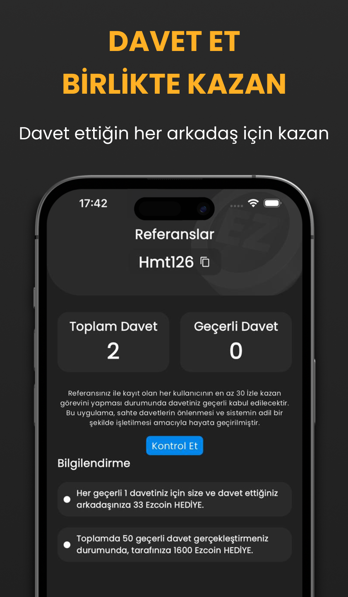
</p> 

## Downloads Links 

<table>
  <tr>
    <td>
        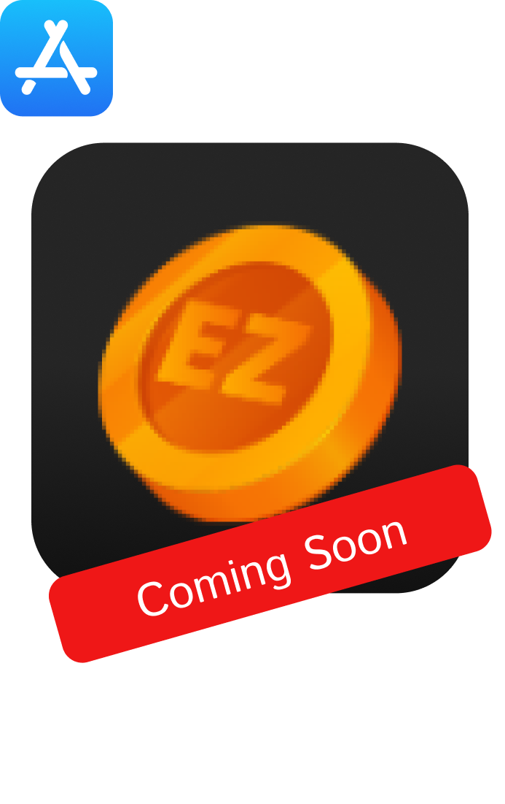
    </td>
    <td>
      <a href="https://play.google.com/store/apps/details?id=com.tuncaygeyik.ezcoin">
        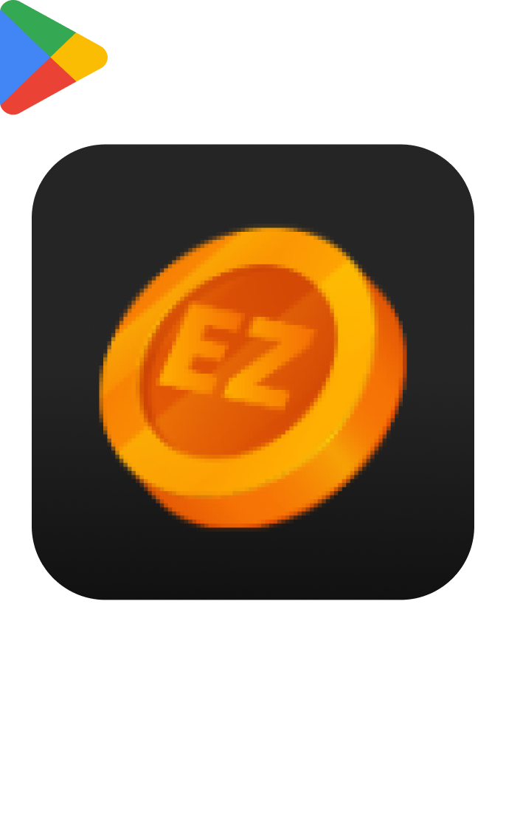
      </a>
    </td>
    
  </tr>
</table>

## Technologies Used

| Technology                | Purpose                                                                                         |
|---------------------------|-------------------------------------------------------------------------------------------------|
| **Firebase Authentication**  | Manages secure user login and authentication flows.                                           |
| **Firebase Cloud Firestore** | Provides a cloud-based NoSQL database for secure, real-time data storage and synchronization.  |
| **Firebase Remote Config**   | Enables dynamic updates to app parameters without requiring an app update.                    |
| **Firebase Analytics**       | Collects user interaction data to optimize and enhance the app experience.                    |
| **Firebase Crashlytics**     | Tracks and resolves app crashes in real-time for improved app stability.                      |
| **Google AdMob**             | Integrates ads for monetization opportunities.                                                |
| **Google Sign-In**           | Allows seamless login using Google credentials.                                               |
| **Apple Sign-In**            | Provides easy login options for Apple users.                                                  |
| **Provider**                 | Efficiently manages app state and ensures responsiveness.                                      |
| **GetX**                     | Simplifies state management with a robust framework.                                          |
| **GetIt**                    | Implements dependency injection for scalable app architecture.                                |
| **Flutter ScreenUtil**       | Facilitates responsive UI designs across various screen sizes.                                |
| **Cached Network Image**     | Efficiently handles image caching for faster load times.                                      |
| **Lottie**                   | Adds animated graphics to improve UI/UX.                                                     |
| **Flutter SVG**              | Supports high-quality vector graphics and icons.                                             |
| **Carousel Slider**          | Enables visually appealing sliders for content display.                                       |
| **Shared Preferences**       | Handles local storage for small-scale data persistence.                                       |
| **Firebase Messaging**       | Enables push notifications to keep users engaged.                                             |
| **OneSignal**                | Powers advanced notification features for better user communication.                          |
| **Awesome Notifications**    | Provides customizable and dynamic local notifications.                                        |
| **Connectivity Plus**        | Monitors and manages internet connectivity states.                                            |
| **Image Picker**             | Supports image selection from the gallery or camera for user-generated content.              |
| **Permission Handler**       | Simplifies app permissions management.                                                       |
| **Flame**                    | Provides tools and libraries for creating engaging games.                                     |
| **Flame SVG**                | Renders scalable vector graphics within the game framework.                                   |
| **Flutter Animate**          | Enables seamless animations for improved user experience.                                     |                      |

## Project Structure

The EzPara project is organized in a modular and scalable manner, ensuring ease of maintenance and code readability. Below is an overview of the directory structure, which highlights the core components, shared utilities, and feature-based folders. 
```bash
lib/
├── core/
│   ├── application/
│   ├── constant/
│   ├── routes/
│   ├── styles/
│   ├── theme/
│   └── dimensions.dart
├── datasource/
│   ├── models/
│   ├── repository/
│   ├── services/
│       ├── admob_services/
│       ├── auth_services/
│       ├── firestore_services/
│       ├── notification_services/
│       ├── storage_services/
│       └── ...
│   └── providers/
├── shared/
│   ├── buttons/
│   ├── components/
│   ├── formFields/
│   ├── scaffolds/
│   └── utils/
├── features/
│   ├── admin/
│       ├── adminCheckout/
│       ├── incomeEvidence/
│       ├── userManagement/
│       └── ...
│   ├── common/
│       ├── auth/
│       ├── verification/
│       ├── landing/
│       ├── profile/
│       ├── splash/
│       ├── update/
│       └── ...
│   ├── superAdmin/
│       ├── userManagement/
│       ├── adminPanel/
│       ├── shopManagement/
│       ├── sliderManagement/
│       ├── taskManagement/
│       └── ...
│   ├── user/
│       ├── awards/
│       ├── checkout/
│       ├── home/
│       ├── playWin/
│       ├── tasks/
│       └── ...
└── main.dart
```

## Directory Explanation

- **core/**: Contains the essential configurations, routes, themes, and constants.
- **datasource/**: Handles data sources, including models, repositories, services, and view models.
- **shared/**: Reusable UI components, utilities, and widgets across the project.
- **features/**: Implements feature-specific modules for handling business logic, such as authentication, play win, profile management, etc.
- **main.dart**: Entry point of the Flutter application.

This structure ensures separation of concerns and clean architecture, making the project easy to extend and maintain as it grows.

## Several Screenshots

<p>
 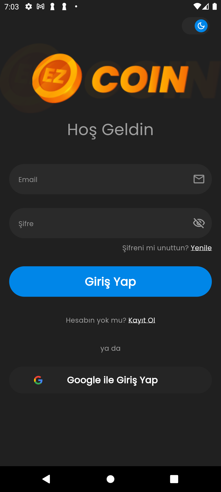
  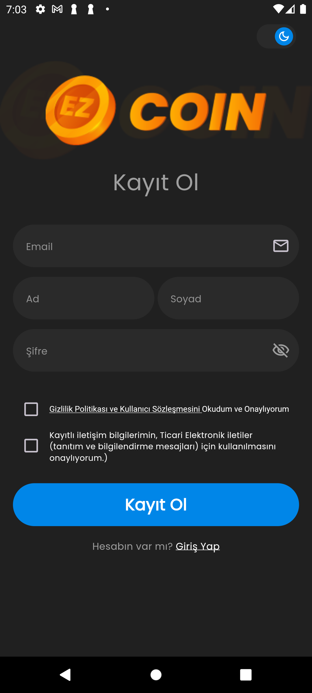
  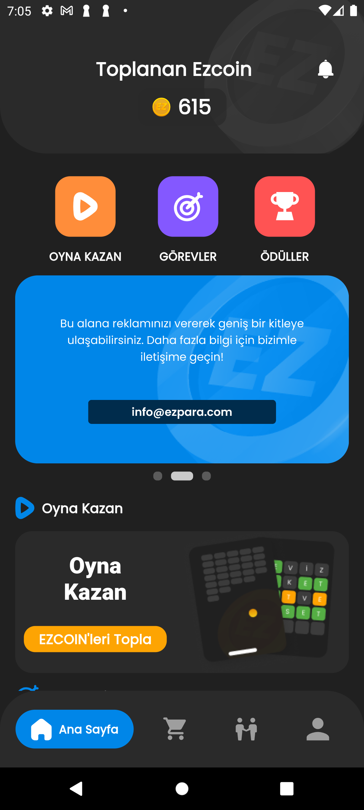
  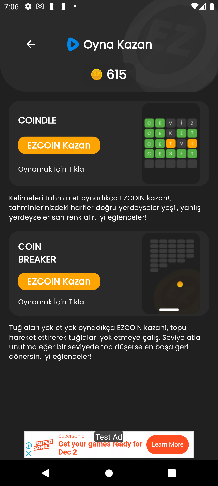
  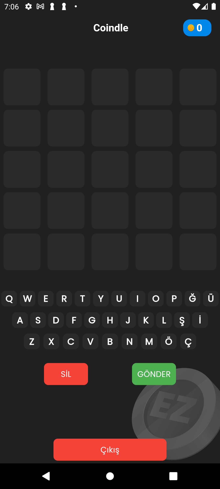
  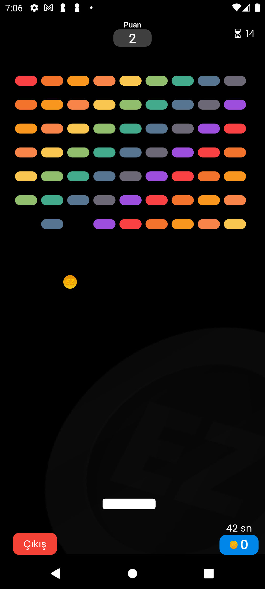
  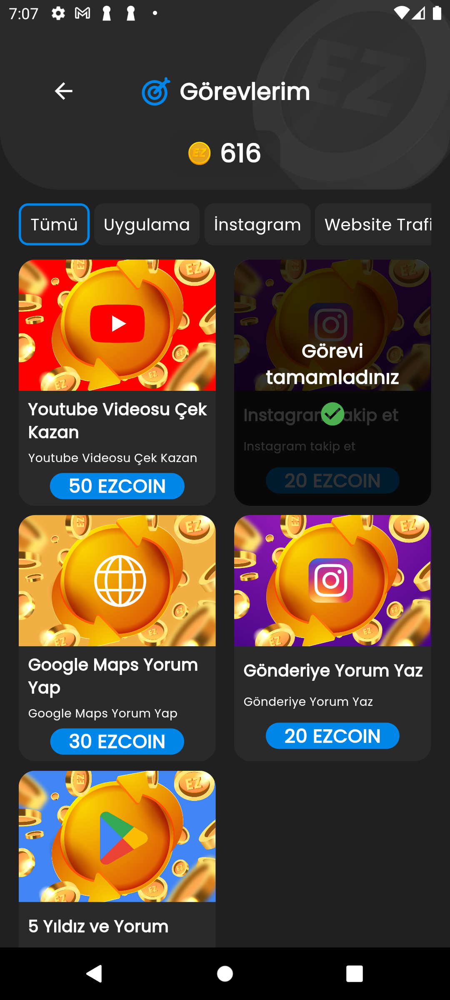
  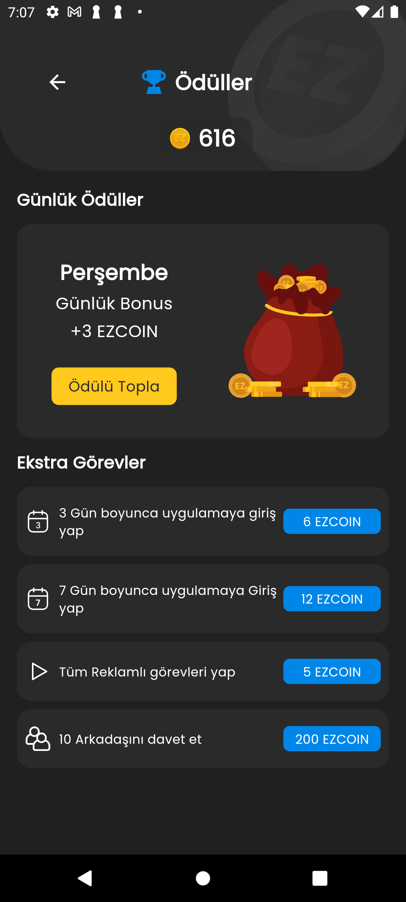
   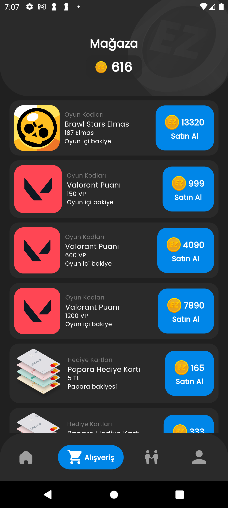
  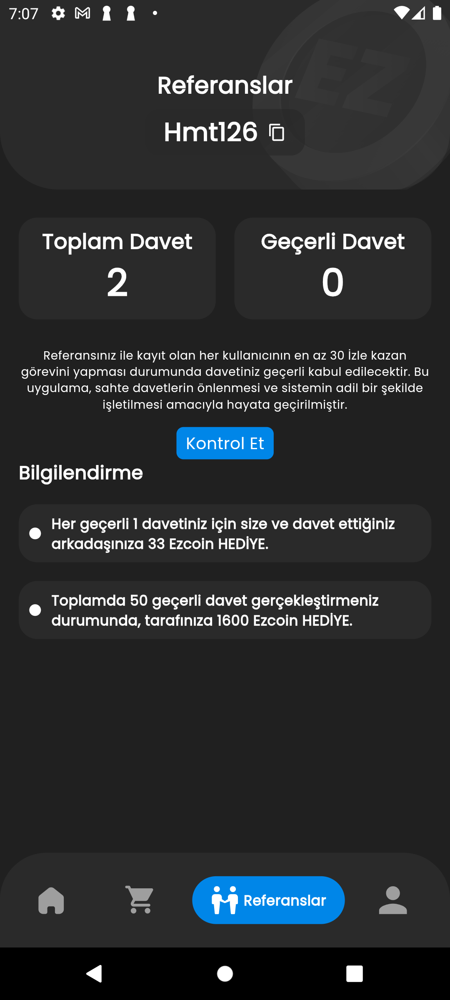
  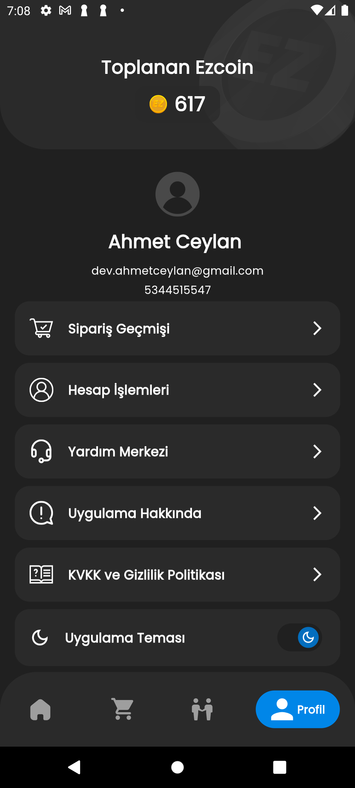
</p>